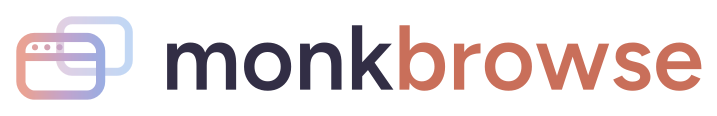

<p align="center">
  <picture>
    <source media="(prefers-color-scheme: dark)" srcset="./assets/logo-wordmark-dark.svg">
    
  </picture>
</p>

<p align="center">
  <strong>One MCP server. Many Chrome tabs. Many Chrome profiles. All at once.</strong>
</p>

<p align="center">
  Let an AI drive the Chrome you already use, logged in, real fingerprint, no relaunch, from Claude, Cursor, VS&nbsp;Code, Windsurf, or any MCP client.
</p>

<p align="center">
  <a href="https://www.npmjs.com/package/monkbrowse"></a>
  <a href="./LICENSE"></a>
  
  
  
</p>

<p align="center">
  <a href="https://monkfromearth.github.io/monkbrowse/"><strong>📖 Docs&nbsp;site</strong></a> ·
  <a href="#install">Install</a> ·
  <a href="#quickstart">Quickstart</a> ·
  <a href="https://monkfromearth.github.io/monkbrowse/guide/use-cases">Use cases</a> ·
  <a href="#the-tools">Tools</a> ·
  <a href="https://monkfromearth.github.io/monkbrowse/guide/architecture">Architecture</a>
</p>

---

> **Live on npm: `npx -y monkbrowse`.** The server publishes to npm; the Chrome extension is loaded unpacked for now (Web Store listing in review). Full docs: **[monkfromearth.github.io/monkbrowse](https://monkfromearth.github.io/monkbrowse/)**.

## What it is

**monkbrowse** is an **MCP server plus a Chrome extension**. The AI talks to the server over stdio; the server drives your real browser through the extension over a local WebSocket. Because it is *your* Chrome, your sessions, cookies, and 2FA are already there, and it works on sites that block headless automation.

What makes it different: **a single server drives many tabs across many Chrome profiles at the same time.** Each profile connects on its own port; each shared tab gets a simple number (1, 2, 3…) shown in the popup. Tools target `{ profile, tab }`, so you can literally tell your AI "on tab 2, do X."

```
                      ┌──── monkbrowse server (one process) ────┐
 AI app ──stdio/MCP──▶│  registry: Map<port, profile>           │
                      │  ws :9222 ─▶ extension · profile "Work"  ├─▶ tabs
                      │  ws :9223 ─▶ extension · profile "Home"  ├─▶ tabs
                      └─────────────────────────────────────────┘
```

## Why a real browser, not headless

| | Headless (Playwright / Puppeteer) | monkbrowse |
|---|---|---|
| Login / cookies / 2FA | re-auth every run | **already logged in** |
| Bot / CAPTCHA walls | frequently blocked | **real fingerprint** |
| Profiles | one clean context | **many real profiles at once** |
| Where it runs | a spawned browser | **the Chrome on your screen** |
| Privacy | varies | **100% local** |

The trade-off: it drives a browser you can see, one action at a time per tab (like a fast human), not a headless farm. That is the point.

**You choose what the AI can see.** By default it sees *nothing*. Each tab has a **Share** toggle in the popup; only shared tabs get a number and become drivable. Your banking tab stays invisible, and a tool call against an unshared tab is refused.

## Install

Two small steps. No path juggling, no build. The server runs from npm with `npx`; your AI app launches it for you. Full guide with every client: **[Install docs](https://monkfromearth.github.io/monkbrowse/guide/install)**.

### Step 1: Add the server to your AI app

**One-click:**

<a href="cursor://anysphere.cursor-deeplink/mcp/install?name=monkbrowse&config=eyJjb21tYW5kIjoibnB4IiwiYXJncyI6WyIteSIsIm1vbmticm93c2UiXX0="></a>
&nbsp;
<a href="vscode:mcp/install?%7B%22name%22%3A%22monkbrowse%22%2C%22command%22%3A%22npx%22%2C%22args%22%3A%5B%22-y%22%2C%22monkbrowse%22%5D%7D"></a>

**Or one command** — the CLI agent you already use:

Claude Code:

```bash
claude mcp add monkbrowse -- npx -y monkbrowse
```

Gemini CLI:

```bash
gemini mcp add monkbrowse npx -y monkbrowse
```

Codex CLI (OpenAI):

```bash
codex mcp add monkbrowse -- npx -y monkbrowse
```

VS Code (also has the button above):

```bash
code --add-mcp '{"name":"monkbrowse","command":"npx","args":["-y","monkbrowse"]}'
```

**Windsurf / Claude Desktop / anything else** — drop this into its MCP config:

```json
{
  "mcpServers": {
    "monkbrowse": {
      "command": "npx",
      "args": ["-y", "monkbrowse"]
    }
  }
}
```

Prefer `bunx monkbrowse` or `pnpm dlx monkbrowse`? Both work. See the [Install docs](https://monkfromearth.github.io/monkbrowse/guide/install) for the exact spot each client keeps this.

### Step 2: Install the Chrome extension

monkbrowse drives your real Chrome, so it needs a small extension. Install it from the **[Chrome Web Store](https://monkfromearth.github.io/monkbrowse/guide/install#_2-install-the-chrome-extension)** (one click, auto-updates).

Open the popup, toggle a tab **on** (it gets a number like `#1`), and tell the AI *"on tab 1, do X."* The AI only ever sees tabs you shared. For multiple Chrome profiles, give each its own port in the popup ([why](https://monkfromearth.github.io/monkbrowse/guide/connection)).

> The one-click configs above work today (`monkbrowse` is on npm). Prefer to hack on it? [Build from source](#build-from-source).

## Quickstart

After the build and both halves are installed:

1. **Share a tab.** Open the monkbrowse popup and flip the **Share** toggle on a tab. It gets a number (1, 2, 3…). Nothing is visible to the AI until you do this.
2. **Prove the round-trip.** Run the doctor with `--probe`, a bare server that reports which profiles connect and reads the shared tab back:

   ```bash
   bun run doctor --probe
   ```

   You should see the connected profile, its port, and its tab count. Stop it with Ctrl-C before your AI app starts its own server (one server per port).
3. **Ask your AI.** With your MCP client running:

   > "On tab 1, take a snapshot."

   The AI calls `browser_snapshot`, gets the accessibility tree back, and can act on it. Try "on tab 1, click Sign in" or "navigate tab 2 to news.ycombinator.com."

## How it works

- The server exposes browser **tools** to the AI and binds **one WebSocket listener per profile port** (default range `9222`–`9241`).
- Each Chrome profile runs the extension, set (in the popup) to connect to **one** port with a friendly **label**. A port identifies a profile.
- A **connection registry** holds every profile at once, so a second profile never evicts the first (the flaw in single-socket designs).
- Inside the extension, an **offscreen document owns the socket** so it survives service-worker suspension; the service worker executes Chrome APIs; a content script builds the accessibility snapshot and runs DOM actions.
- Most actions return a fresh **accessibility snapshot** of the tab, so the AI "sees" the result without needing a screenshot.

Full detail: **[docs/ARCHITECTURE.md](docs/ARCHITECTURE.md)** · wire protocol: **[docs/PROTOCOL.md](docs/PROTOCOL.md)**.

## Extending monkbrowse

monkbrowse is **protocol-driven**: every tool's name, description, and argument schema live in one place (`packages/protocol`), and both the server and the extension import the *same* schemas. Add a tool there and it appears to the AI, routes through the server, and executes in the browser, with the type checker catching any mismatch across the boundary.

Adding a browser tool spans **four touch points**:

| # | Where | What you add |
|---|---|---|
| 1 | `packages/protocol/src/tools.ts` | The AI-facing `ToolDef` (name, description, zod args). Add it to `ALL_TOOLS`. Include `...target` for tab-scoped tools. |
| 2 | `packages/protocol/src/messages.ts` | The wire message: request payload (with `tabId?`) + response (echoes `tabId`). Skip for server-only tools. |
| 3 | `apps/server/src/tools/index.ts` | The handler in `toolHandlers`. Use `onTab(...)` to resolve profile + tab, `registry.send(...)`, and append a snapshot if it mutates the page. |
| 4 | `apps/extension/lib/executor.ts` | The executor branch in `execWire`. Tabs/navigation run in the service worker; DOM ops delegate to the content script. |

Then `bun run typecheck` (the shared schema fails to compile on a mismatch) and exercise it. Server-only tools (like `browser_wait`) skip steps 2 and 4.

Guides: **[.claude/rules/mcp-tools.md](.claude/rules/mcp-tools.md)** and the `add-mcp-tool` skill. There is also a **`browser_evaluate`** escape hatch (run any JS expression in the page) if you need something before writing a first-class tool.

## The tools

22 tools today. Full arguments and behavior: **[docs/TOOLS.md](docs/TOOLS.md)**.

| Group | Tools |
|---|---|
| **Navigation** | `browser_navigate` · `browser_go_back` · `browser_go_forward` · `browser_reload` |
| **Reading** | `browser_snapshot` · `browser_get_text` · `browser_screenshot` · `browser_get_console_logs` · `browser_evaluate` |
| **Interacting** | `browser_click` · `browser_hover` · `browser_type` · `browser_select_option` · `browser_press_key` · `browser_scroll` · `browser_drag` · `browser_upload_file` |
| **Timing** | `browser_wait` |
| **Tabs & profiles** | `browser_list_tabs` · `browser_switch_tab` · `browser_new_tab` · `browser_close_tab` |

Highlights: the snapshot is **shadow-DOM and same-origin-iframe aware**; reads that time out retry automatically while actions never silently re-send; calls to different tabs run in parallel while two mutations on the *same* tab are serialized.

## Repo layout

```
apps/server        MCP server (stdio ↔ AI, one WebSocket per profile port)
apps/extension     MV3 Chrome extension (WXT), one instance per Chrome profile
packages/protocol  zod: AI tool schemas + server↔extension wire messages
packages/messaging transport-agnostic request/response peer
packages/config    port range, names
packages/utils     shared helpers
assets/            brand: logo, wordmark, lockup, icon
```

<a id="build-from-source"></a>

## Develop

Building from source (for contributors, or to run before the npm publish lands):

```bash
bun install
bun run build              # server → apps/server/dist/index.js ; extension → apps/extension/dist/chrome-mv3
```

Then point your client at `bun /ABSOLUTE/PATH/apps/server/dist/index.js` and load `apps/extension/dist/chrome-mv3` unpacked. Full dev commands:

```bash
bun run typecheck          # turbo, all packages + apps (also the isomorphism guard)
bun run test               # bun test, unit + server integration (no browser needed)
bun run build              # server → apps/server/dist ; extension → apps/extension/dist/chrome-mv3
bun run doctor             # bare server that prints which Chrome profiles connect
bun run dev:server         # bun --watch on the server
bun run dev:extension      # wxt dev
bun run package:extension  # wxt zip
```

Two hard rules for this repo: the **server stays Node-compatible** (no `Bun.*` in `apps/server`), and **`packages/protocol` + `packages/messaging` stay isomorphic** (no `node`/`chrome`/`DOM` globals, so they bundle into both the Node server and the MV3 service worker). See **[.claude/rules/monorepo.md](.claude/rules/monorepo.md)**.

## Privacy

**100% local.** The server binds only to `127.0.0.1`, the extension talks only to that local server, and **nothing is sent to us or any third party** — no telemetry, no analytics, no account. The AI sees only the tabs you explicitly share, and a call against an unshared tab is refused. Full [privacy policy](https://monkfromearth.github.io/monkbrowse/privacy).

## Status

The server is **published on npm** (`npx -y monkbrowse`); the extension runs unpacked while its **Chrome Web Store listing is in review**. Server and extension build, typecheck, and pass ~96 tests, including a headless-DOM harness that exercises the real DOM engine (shadow DOM, iframes, actions), a fake-`chrome` layer that drives the real executor, and a full loop (MCP tool → server → messaging → executor → real DOM) with no browser involved. Ongoing hardening: cross-origin iframes and snapshot tuning on complex SPAs.

## Credits

Turborepo + Bun + TypeScript. The real-browser approach is adapted from the [Playwright MCP server](https://github.com/microsoft/playwright-mcp) and the original [Browser MCP](https://browsermcp.io); the multi-profile architecture, extension, and brand here are built fresh.

## License

Apache 2.0. See [LICENSE](./LICENSE).
